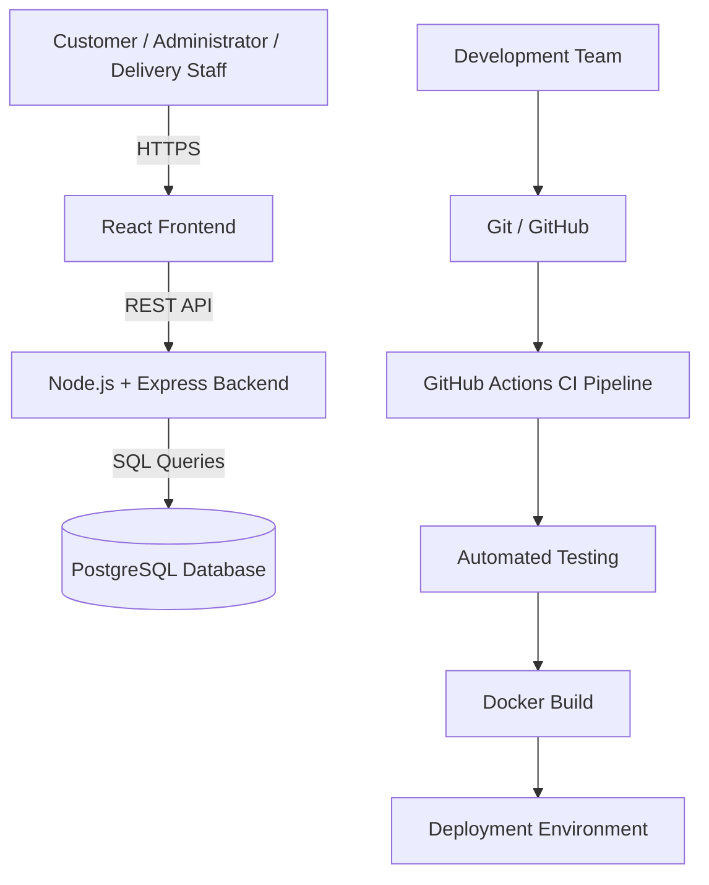
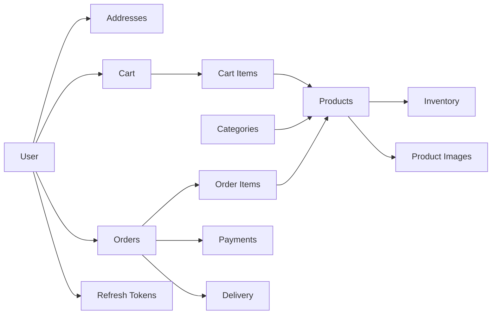

# DevOps-Enabled E-Commerce System

A full-stack e-commerce web application developed using modern Software Engineering and DevOps practices.

The system provides standard online shopping functionality while integrating version control, automated testing, containerization, Continuous Integration, Continuous Deployment, and deployment automation throughout the software development lifecycle.

---

## Project Overview

The **DevOps-Enabled E-Commerce System** allows customers to browse products, manage shopping carts, place orders, and track deliveries through a web-based platform.

Administrators will be able to manage products, users, orders, inventory, and business operations, while delivery staff will manage assigned deliveries and update shipment status.

Unlike a basic e-commerce application, this project also demonstrates practical DevOps concepts including:

- Git-based version control
- Docker containerization
- PostgreSQL containerized database
- Automated testing
- Continuous Integration
- Continuous Deployment
- Environment-based configuration
- Health monitoring
- Deployment automation

---

## Objectives

The major objectives of the project are:

- Develop a secure and responsive e-commerce platform.
- Provide customer registration and authentication.
- Implement role-based authorization.
- Provide product and category management.
- Implement shopping cart functionality.
- Implement order and inventory management.
- Support payment and delivery workflows.
- Maintain secure and scalable backend architecture.
- Containerize application services using Docker.
- Implement automated testing.
- Implement CI/CD using GitHub Actions.
- Maintain meaningful Git version history throughout development.

---

## Technology Stack

| Layer | Technology |
|---|---|
| Frontend | React.js, Vite |
| Backend | Node.js, Express.js |
| Database | PostgreSQL |
| Database Driver | node-postgres (`pg`) |
| Validation | Zod |
| Authentication | JWT, bcrypt |
| Containerization | Docker |
| Container Orchestration | Docker Compose |
| Version Control | Git |
| Repository Hosting | GitHub |
| CI/CD | GitHub Actions |
| Backend Testing | Jest, Supertest |
| API Testing | Postman |

---

## System Architecture



---

## Project Structure

```text
devops-enabled-ecommerce-system/
│
├── frontend/
│   └── React + Vite frontend application
│
├── backend/
│   ├── src/
│   │   ├── config/
│   │   ├── controllers/
│   │   ├── middleware/
│   │   ├── models/
│   │   ├── routes/
│   │   ├── services/
│   │   ├── utils/
│   │   ├── validators/
│   │   ├── app.js
│   │   └── server.js
│   │
│   ├── tests/
│   ├── .env.example
│   └── package.json
│
├── database/
│   ├── migrations/
│   │   ├── 001_initial_schema.sql
│   │   └── 002_add_refresh_tokens.sql
│   │
│   └── seeds/
│
├── docker/
│
├── docs/
│
├── .github/
│   └── workflows/
│
├── .env.example
├── .gitignore
├── docker-compose.yml
└── README.md
```

---

## Database Architecture

The application uses PostgreSQL as its relational database.

Current database entities include:

- Users
- Addresses
- Categories
- Products
- Product Images
- Inventory
- Shopping Carts
- Cart Items
- Orders
- Order Items
- Payments
- Deliveries
- Audit Logs
- Refresh Tokens

### Main Relationships



---

## Current API Endpoints

### Health

| Method | Endpoint | Description |
|---|---|---|
| GET | `/` | API information |
| GET | `/api/health` | Backend health check |
| GET | `/api/health/database` | PostgreSQL health check |

### Authentication

| Method | Endpoint | Description |
|---|---|---|
| POST | `/api/auth/register` | Register customer |
| POST | `/api/auth/login` | Authenticate user |
| POST | `/api/auth/refresh` | Refresh access token |
| POST | `/api/auth/logout` | End user session |
| GET | `/api/auth/me` | Retrieve authenticated user |

Additional API modules will be introduced as development continues.

---

## Authentication Architecture

The authentication system uses:

- bcrypt password hashing
- JWT access tokens
- Short-lived access sessions
- Secure refresh tokens
- Hashed refresh-token storage
- HttpOnly cookies
- Refresh-token rotation
- Role-based authorization
- Request validation
- Authentication rate limiting
- Centralized error handling

Supported roles are:

```text
CUSTOMER
ADMIN
DELIVERY_STAFF
```

Public registration creates only `CUSTOMER` accounts.

Administrative and delivery roles cannot be assigned through public registration.

---

## Environment Configuration

Real credentials must never be committed to Git.

Create local `.env` files using the provided `.env.example` files.

### Root Environment

```env
POSTGRES_DB=ecommerce_db
POSTGRES_USER=ecommerce_user
POSTGRES_PASSWORD=your_local_database_password
POSTGRES_PORT=5432
```

### Backend Environment

```env
NODE_ENV=development

PORT=5000

DB_HOST=localhost
DB_PORT=5432
DB_NAME=ecommerce_db
DB_USER=ecommerce_user
DB_PASSWORD=your_local_database_password
DB_SSL=false

FRONTEND_URL=http://localhost:5173

JWT_ACCESS_SECRET=replace_with_a_long_random_secret
JWT_ACCESS_EXPIRES_IN=15m

REFRESH_TOKEN_EXPIRES_DAYS=7
BCRYPT_ROUNDS=12
```

Never commit actual `.env` files.

---

## Running the Project Locally

### Prerequisites

Install:

- Node.js
- npm
- Git
- Docker Desktop
- Docker Compose

---

### 1. Clone Repository

```bash
git clone <repository-url>
cd devops-enabled-ecommerce-system
```

---

### 2. Start PostgreSQL

```bash
docker compose up -d postgres
```

Verify:

```bash
docker compose ps
```

The PostgreSQL container should report:

```text
healthy
```

---

### 3. Install Frontend Dependencies

```bash
cd frontend
npm install
```

Start the frontend:

```bash
npm run dev
```

Frontend development server:

```text
http://localhost:5173
```

---

### 4. Install Backend Dependencies

```bash
cd backend
npm install
```

Create the backend `.env` file using `.env.example`.

Start the backend:

```bash
npm run dev
```

Backend API:

```text
http://localhost:5000
```

---

## Database Migrations

Database schema changes are versioned inside:

```text
database/migrations/
```

Current migrations:

```text
001_initial_schema.sql
002_add_refresh_tokens.sql
```

Example migration execution on Windows PowerShell:

```powershell
Get-Content database\migrations\001_initial_schema.sql |
docker exec -i ecommerce-postgres psql -U ecommerce_user -d ecommerce_db
```

Migration files that have already been committed and applied should not normally be modified.

Future changes should use new migration files such as:

```text
003_add_product_reviews.sql
004_add_wishlist.sql
005_add_coupon_system.sql
```

---

## Docker

The development PostgreSQL database currently runs inside Docker.

```bash
docker compose up -d postgres
```

Stop services:

```bash
docker compose stop
```

Start services again:

```bash
docker compose start
```

Remove containers:

```bash
docker compose down
```

Database data is stored in a persistent Docker volume.

---

## Security Practices

The project follows several application security practices:

- Passwords are hashed before database storage.
- Plaintext passwords are never stored.
- Secrets are stored through environment variables.
- `.env` files are excluded from Git.
- Access tokens are short-lived.
- Refresh tokens are stored as hashes.
- Refresh-token rotation is supported.
- Authentication endpoints are rate-limited.
- Helmet security headers are enabled.
- Role-based authorization is implemented.
- SQL queries use parameterized values.
- Public registration cannot assign privileged roles.

---

## Development Roadmap

### Phase 1 — Foundation

- [x] Git repository initialization
- [x] Project directory structure
- [x] React + Vite frontend
- [x] Express backend
- [x] Docker installation and configuration
- [x] PostgreSQL Docker service
- [x] Persistent database storage
- [x] Initial relational database schema
- [x] Backend PostgreSQL integration

### Phase 2 — Application Development

- [x] Authentication architecture
- [x] Registration and login implementation
- [x] JWT access token support
- [x] Refresh-token session architecture
- [x] Role-based authorization foundation
- [ ] Automated authentication tests
- [ ] Product management
- [ ] Category management
- [ ] Inventory management
- [ ] Shopping cart
- [ ] Checkout
- [ ] Order management
- [ ] Payment workflow
- [ ] Delivery management
- [ ] Admin dashboard
- [ ] Customer frontend

### Phase 3 — Quality & DevOps

- [ ] Jest unit/integration tests
- [ ] Supertest API tests
- [ ] Frontend testing
- [ ] Dockerize backend
- [ ] Dockerize frontend
- [ ] Complete Docker Compose environment
- [ ] GitHub Actions CI
- [ ] Automated build pipeline
- [ ] Automated testing pipeline
- [ ] Docker image build pipeline
- [ ] Continuous Deployment

### Phase 4 — Production

- [ ] Production deployment
- [ ] HTTPS
- [ ] Reverse proxy
- [ ] Monitoring
- [ ] Logging
- [ ] Deployment documentation
- [ ] Final testing
- [ ] Final project documentation

---

## Development Workflow

The project follows incremental development with meaningful Git commits.

Example commit conventions:

```text
feat: add product management API
fix: prevent duplicate cart items
test: add authentication integration tests
docs: update project documentation
chore: configure development environment
ci: add backend test workflow
refactor: improve authentication service
```

---

## Team Members

- Aadarsha Subedi
- Bipin Lamsal
- Sneha Lamichhane

---

## Academic Context

This project is being developed as part of the Software Engineering course and demonstrates practical application of:

- Requirements Engineering
- Object-Oriented Analysis and Design
- Software Architecture
- Database Design
- Version Control
- Testing
- Agile Development
- DevOps
- CI/CD
- Containerization
- Software Deployment

---

## Project Status

**Active Development**

Current milestone:

> Backend, PostgreSQL, Docker, database architecture, and authentication foundation established.

Next milestone:

> Automated authentication testing using Jest and Supertest.